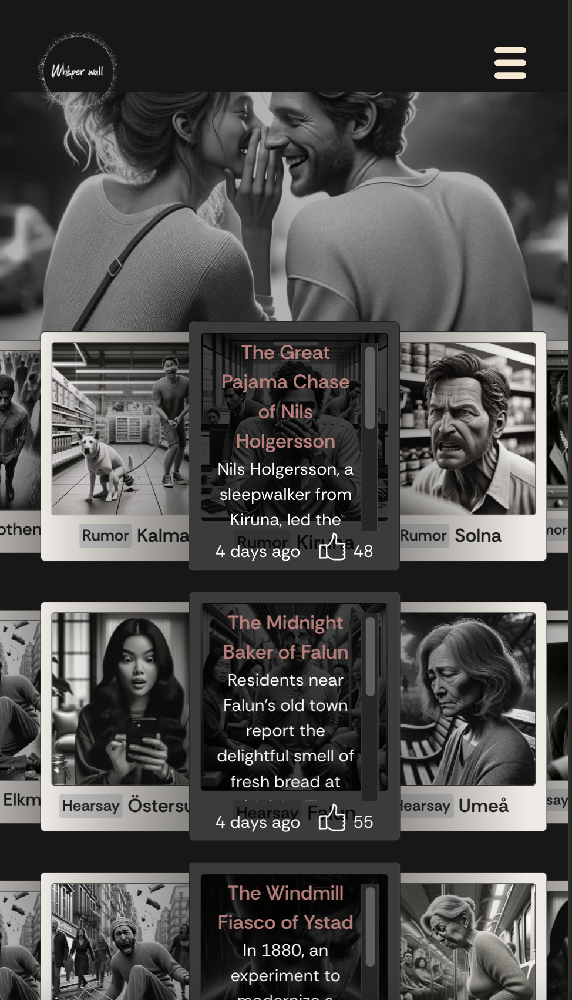
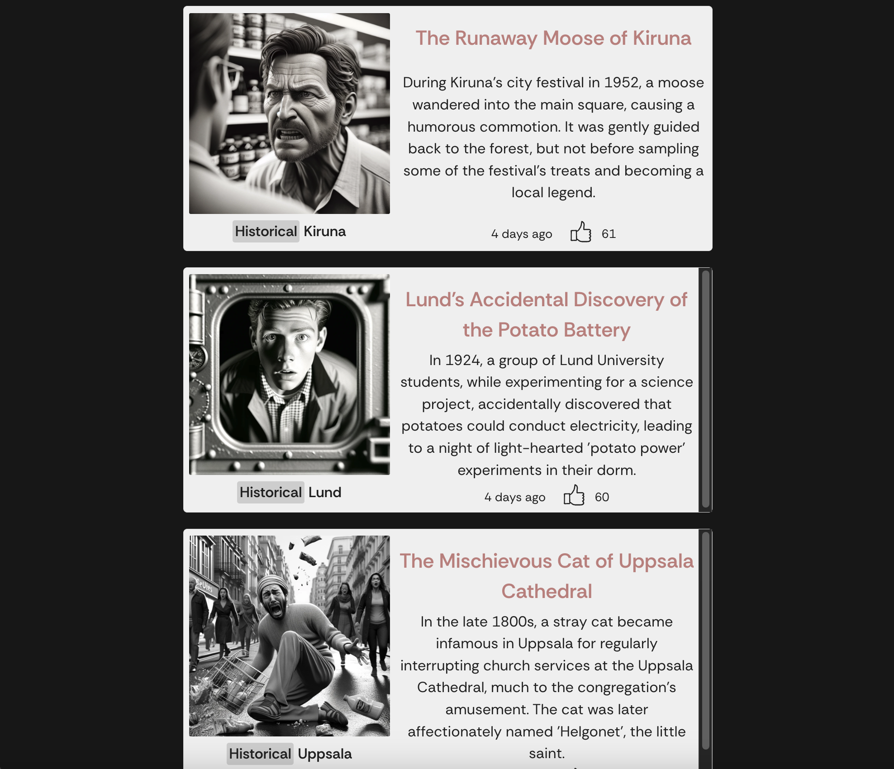
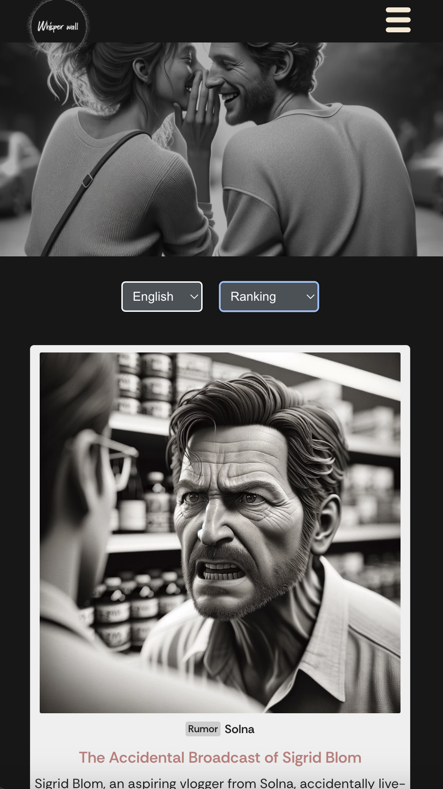
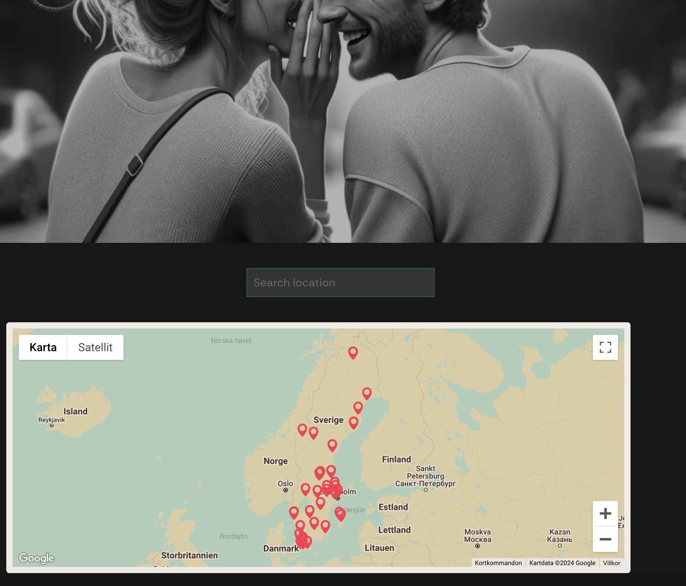
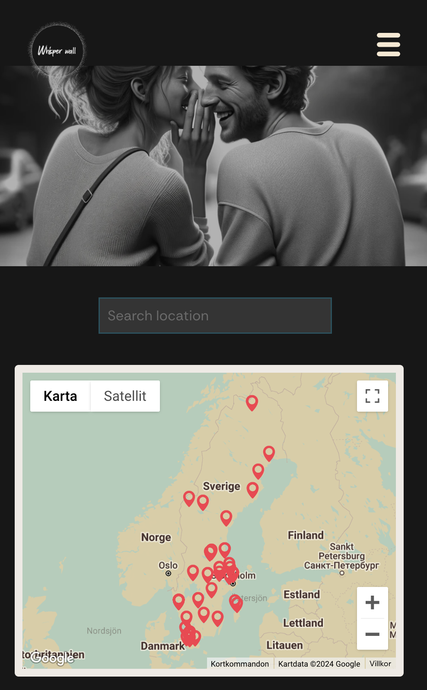
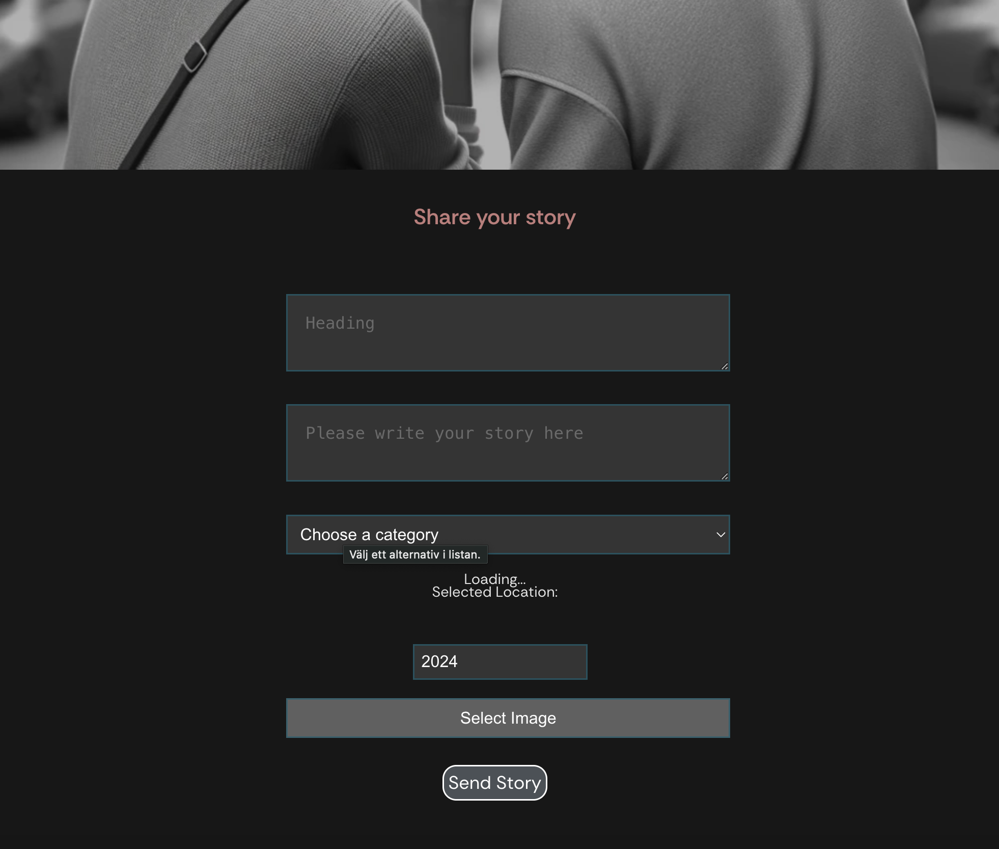
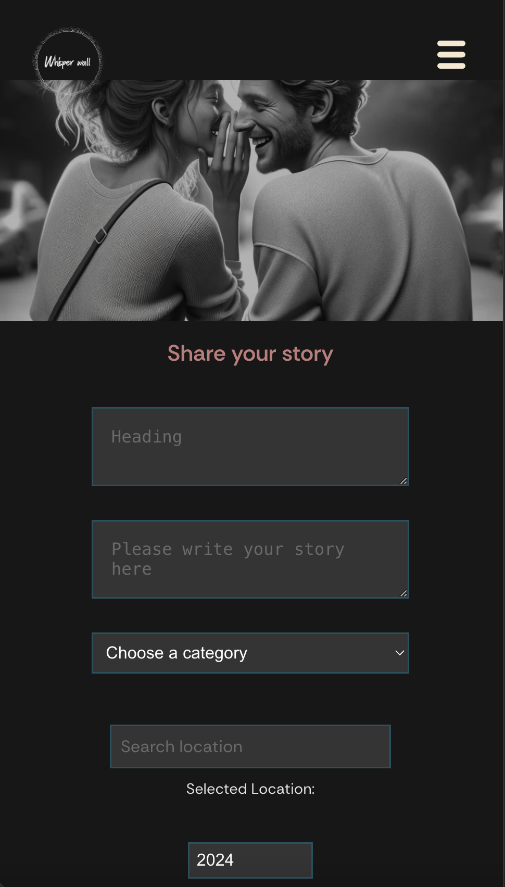
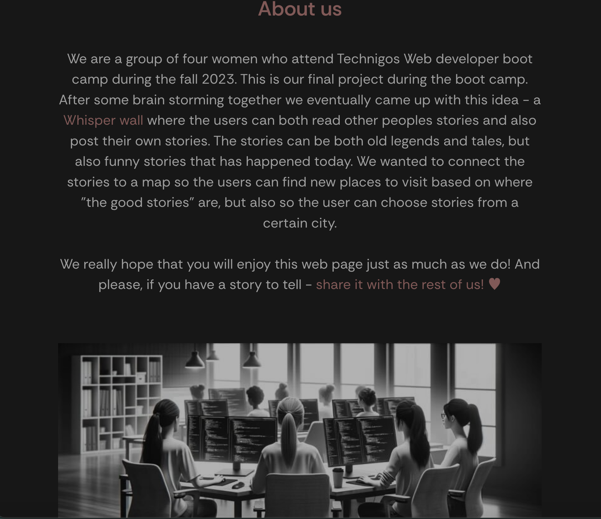
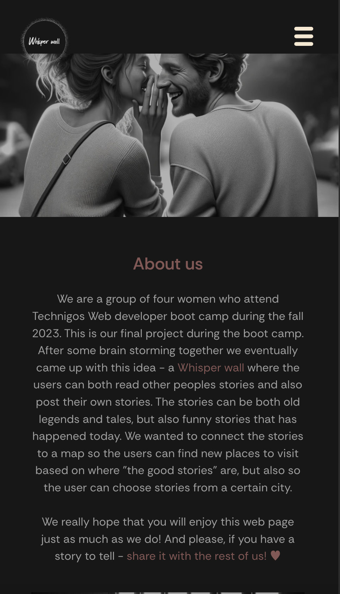

# Final Project - Whisper Wall

Description

Whisper Wall is a full-stack web application designed for anonymously posting and reading stories in various categories like hearsays, rumors, and anecdotes. It features a ranking system based on likes, filters for sorting stories, and a Google Map integration for geographical storytelling. The project also uses external APIs for dynamic translation and content analysis.

Technologies

This project is built using a range of technologies:

Frontend: JavaScript, HTML, CSS, React, Swiper, date-fns, dotenv, js-datepicker, react-calendar, react-datepicker, react-modal, react-router-dom, swiper.
Backend: Node.js, Express, MongoDB, Mongoose, Dotenv, Express-async-handler, Express-list-endpoints, Jsonwebtoken,
APIs: Google Cloud Language API, Google Cloud Translate API, Google Maps API.
DevOps/Tools: Git, GitHub, Vite, Babel, ESLint
Database: MongoDB

Installation and setup

Clone the repository.
Navigate to the project directory.
Install dependencies:
For frontend, run `npm install` in the final-project-frontend directory.
For backend, run `npm install` in the final-project-backend directory.
Set up environment variables as required.
Start the application:
For frontend, run `npm run dev`.
For backend, run `npm run dev`.

Post and view stories in various categories.
Interact with stories through likes and rankings.
Filter stories by categories, cities, or ranking.
Google Map integration for location-based storytelling.
Dynamic translation and content analysis functionalities.
Contributing

Interested in contributing? Please contact us through GitHub or LinkedIn.

Team and Contact

Sandra Gustafssson - www.linkedin.com/in/sandra-gustafsson-3665061a5
Emmy Jansson - https://linkedin.com/in/emmy-jansson-2104a3293
Carolina Luna - https://linkedin.com/in/carolina-luna-b1659251
Frida Lindskog - https://linkedin.com/in/frida-lindskog-0566b5149

License

Licensed under the ISC License.

